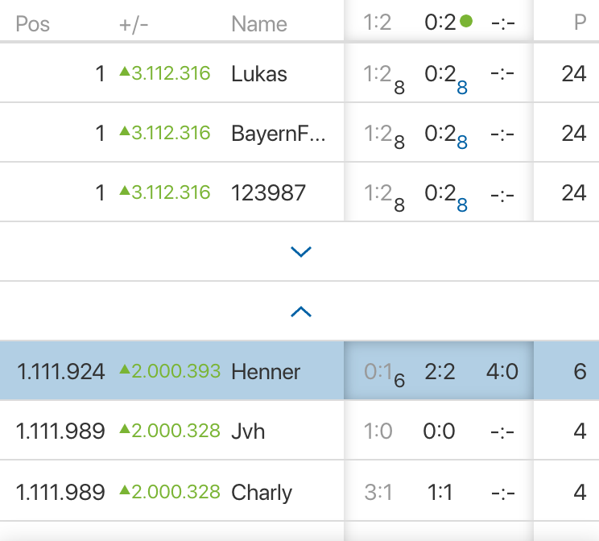
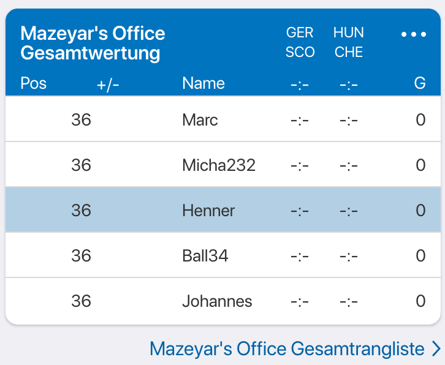

# CHECK24 GenDev Tippspiel Challenge

**Note:** This is the challenge for the 5th round of the GenDev Scholarship. We're looking forward to your application - happy coding. 🤓

This coding challenge is about a "Tippspiel" (betting game) for the soon-to-be happening **European Championship 2024**, which takes place in Germany beginning at the 14th of June 2024 and [we as CHECK24 are very excited about](https://www.youtube.com/watch?v=7Xb9gPJjJM8). The goal is to create a simple application that allows you and your friends (and some [more soccer fans](#the-challenge)) to bet on the outcome of the games and to display the current standings of the participants. This can be done creating a console ⌨️, native app 📱 or web 💻 application using your favorite programming language and framework.

Sounds like a challenge you want to tackle? Let's dive into it! 🤓

## Table of Contents

- [The challenge](#the-challenge) ⚽️
- [The requirements](#the-requirements) 
  - [The UI](#the-ui) 🖥️
  - [Authenticating users (simple approach)](#authenticating-users-simple-approach) 🔓
  - [Communities](#communities) 🙋‍♀️🙋‍♂️
  - [Community Leaderboards](#community-leaderboards) 📈
  - [Pagination of the leaderboard](#pagination-of-the-leaderboard) 🖱️
  - [Real-time updates](#real-time-updates) ⏱️
  - [Dashboard](#dashboard) 📊
  - [Pinning friends](#pinning-friends) 📌
  - [Persisting data](#persisting-data) 💽
  - [Want to be extra fancy?](#want-to-be-extra-fancy) 💅
- [We support you with...](#we-support-you-with)
  - [List of games of the European Championship 2024](#list-of-games-of-the-european-championship-2024) 🏆
  - [The logic to calculate the points for the users](#the-logic-to-calculate-the-points-for-the-users) 🧮
- [How do I hand in my project?](#how-do-i-hand-in-my-project) 🚀
  - [Questions?](#questions) ❓

## The challenge

**Performance is key in this challenge.** 🚀

You'll write an application that allows users to bet on the outcome of the games of the European Championship 2024. The application should be able to handle multiple users, games, bets, and outcomes. The application should be able to display the current standings of the participants.

_The most important_ part is to live update the standings of the participants (users) of your application when a goal is scored or a game ends. This can be done by using a WebSocket connection, polling, or any other method of your choice. Standings should be updated in **real-time** and your application should to handle **up to 2 million active participants**, while 10.000 users are active at the same time observing the current standings.

**We provide you with...**

- A [list of games](#list-of-games-of-the-european-championship-2024) and their start times of the European Championship 2024.
- The [logic to calculate the points](#the-logic-to-calculate-the-points-for-the-users) for the users based on their bets and the outcomes of the games.
- Some [requirements](#the-requirements) for the behavior of the application.

---

## The requirements

### The UI

The UI should be simple and easy to use - sky is the limit. You can come up with something fancy, but this is not what we focus on the most in this challenge. Once you fulfilled the basic requirements listed below, you can add some fancy features to your application if you'd like to - we're looking forward to seeing your creativity.

We are open for different technologies and frameworks, so feel free to create an iOS or Android app, a web application, or even a (usable) console application. We won't judge your creativity in UI, but still you should make sure your application fulfills some basic UX principles to make your application easy to use.

### Authenticating users (simple approach)

You don't need to come up with something fancy for the authentication of the users.

You could let the user select a username and that's it.
Once the user wants to log in, simply ask for his username, not even a password.
We don't want you to focus too much on this part during the challenge.

**Important: a username is not changeable.**

### Communities

Your application will be used to bring your friends together.

Not just your friends, but also potentially 2 million other soccer fans. Therefore, you should provide the possibility for your users to create communities their friends can join. You should be able to see the standings of your community and the standings of the whole European Championship 2024 tournament.

Think about different screens for the different communities and the whole tournament, e.g.:

- Tournaments
  - Euro 2024
    - Communities
      - Community A
      - Community B
    - Global Standings

Users should be able to be part of up to 5 communities (by creating or joining them) and should be able to see the standings of the communities they are part of.

### Community Leaderboards

Besides the Community pages (stated in [Communities](#communities)) you should provide a leaderboard for each community. The leaderboard should display the current standings of the participants of the community.

Leaderboards are kinda complex to implement, so you should think about a way to implement them in a way that they are scalable and can handle a lot of users by also providing real-time updates of the standings of the participants.

Within the leaderboard, you should be able to search for a user, pin users and show a flexible amount of users in total:

- show the top 3 users of the community
- show the user who is currently logged in
- show the user who is currently on the last place
- show all users who were pinned by the logged-in user (see [Pinning friends](#pinning-friends))

The leaderboard should show the following information for each user:
- the username
- the current points
- the current rank
- (+ additional information you think is important)

### Pagination of the leaderboard

The leaderboard should be paginated. You should be able to show a flexible amount of users per page. The default amount of users per page should be 10.

As a user I want to be able to navigate before my and after the top positions in the leaderboard by clicking (e.g. arrows). To get a better idea of what we are talking about, check out the following screenshot:



On every click there should pop up additional 10 users on the specific positions. If there are no users on the next "page", the button should be hidden.

### Betting

Betting is enabled until the game starts. Once the game starts, the user should not be able to bet on the game anymore.

There is only one thing the user can bet on: the result of the game. The user should be able to bet on the result of the game by entering the number of goals for the home team and the number of goals for the away team.

### Real-time updates

It's quite important to note that the European Championship 2024 is a big event and the application should be able to handle a lot of users. Users should have the feeling that your application can provide near-to-real-time updates of the standings.

Therefore, you should provide the possibility for you as an application "admin" to (manually) update the game results somehow without "restarting" the application or the need of changing the code of your application.

### Dashboard

Your application should provide a dashboard of the given European Championship 2024 tournament. The dashboard should display the current standings of the participants and the games that are currently being played or are about to start.

The dashboard should also show a sneak preview of the community leaderboards the user is part of plus the global leaderboard of the European Championship 2024 tournament.

This sneak preview consists of:
- the top 3 users of the community
- the user who is currently logged in
- the user who is currently before the logged-in user
- the user who is currently after the logged-in user
- the user who is currently on the last place

Which sums up to 7 users in total in these sneak preview leaderboards.

Make sure to think of these scenarios:
- the logged-in user can be part of the top 3 users of the community (no duplicates in the leaderboard) *
- the logged-in user can be on the last place of the community (no duplicates in the leaderboard) *
- ranks are determined like this: 1, 1, 1, 4
- sort by users registration date when points are equal
- when community has less than 7 users: show all the users who are part of the community

* you will still need to return 7 users in total. This means you have to "fill out" your preview by showing more users around the logged-in user.

The following screenshot shows a possible sneak preview of the community leaderboards:



### Pinning friends

You might want to pin your friends within community leaderboards to see their current standings by clicking on their name within a leaderboard. There is no maximum pins per user per community.

By pinning friends of yours within a community leaderboard, you should be able to always see them in the leaderboard (see [Leaderboards](#community-leaderboards)).

### Persisting data

Make sure to persist the data of the users, the communities, the bets, and the games. You can use a database of your choice to persist the data. After a restart, the leaderboard and all the functionalities should stay the same but startup time is OK.

### Want to be extra fancy?

[Display a delta of the current standings](./assets/leaderboard-pagination.png) of the participants in the leaderboard. This delta should be calculated based on the standings of yesterday (00:00 o'clock) and the current standings of the participants.

---

## We support you with...

### List of games of the European Championship 2024

You will find the participants of the European Championship 2024 at the following URL: https://en.wikipedia.org/wiki/UEFA_Euro_2024#Qualified_teams
The last qualification games will be played in the end of March 2024, so the list of teams will be complete after that date.

The games of the European Championship 2024 for now are as follows (CSV format):

```csv
team_home_name;team_away_name;game_starts_at
Deutschland;Schottland;2024-06-14 19:00:00
Ungarn;Schweiz;2024-06-15 13:00:00
Spanien;Kroatien;2024-06-15 16:00:00
Italien;Albanien;2024-06-15 19:00:00
tbd;Niederlande;2024-06-16 13:00:00
Slowenien;Dänemark;2024-06-16 16:00:00
Serbien;England;2024-06-16 19:00:00
Rumänien;tbd;2024-06-17 13:00:00
Belgien;Slowakei;2024-06-17 16:00:00
Österreich;Frankreich;2024-06-17 19:00:00
Türkei;tbd;2024-06-18 16:00:00
Portugal;Tschechische Republik;2024-06-18 19:00:00
Kroatien;Albanien;2024-06-19 13:00:00
Deutschland;Ungarn;2024-06-19 16:00:00
Schottland;Schweiz;2024-06-19 19:00:00
Slowenien;Serbien;2024-06-20 13:00:00
Dänemark;England;2024-06-20 16:00:00
Spanien;Italien;2024-06-20 19:00:00
Slowakei;tbd;2024-06-21 13:00:00
tbd;Österreich;2024-06-21 16:00:00
Niederlande;Frankreich;2024-06-21 19:00:00
tbd;Tschechische Republik;2024-06-22 13:00:00
Türkei;Portugal;2024-06-22 16:00:00
Belgien;Rumänien;2024-06-22 19:00:00
Schottland;Ungarn;2024-06-23 19:00:00
Schweiz;Deutschland;2024-06-23 19:00:00
Albanien;Spanien;2024-06-24 19:00:00
Kroatien;Italien;2024-06-24 19:00:00
Niederlande;Österreich;2024-06-25 16:00:00
Frankreich;tbd;2024-06-25 16:00:00
England;Slowenien;2024-06-25 19:00:00
Dänemark;Serbien;2024-06-25 19:00:00
Slowakei;Rumänien;2024-06-26 16:00:00
tbd;Belgien;2024-06-26 16:00:00
tbd;Portugal;2024-06-26 19:00:00
Tschechische Republik;Türkei;2024-06-26 19:00:00
2A;2B;2024-06-29 16:00:00
1A;2C;2024-06-29 19:00:00
1C;3EDF;2024-06-30 16:00:00
1B;ADEF;2024-06-30 19:00:00
2D;2E;2024-07-01 16:00:00
1F;3ABC;2024-07-01 19:00:00
1E;ABCD;2024-07-02 16:00:00
1D;2F;2024-07-02 19:00:00
W39;W37;2024-07-05 16:00:00
W41;W42;2024-07-05 19:00:00
W40;W38;2024-07-06 16:00:00
W43;W44;2024-07-06 19:00:00
W45;W46;2024-07-09 19:00:00
W47;W48;2024-07-10 19:00:00
W49;W50;2024-07-14 19:00:00
```

### The logic to calculate the points for the users

The points for the users bets are calculated as follows:

**8 points for the exact result 🥳**

Let's say the game is "Deutschland" vs. "Schottland" and the user bets 3:1 for "Deutschland". The game ends 3:1 for "Deutschland". The user gets 8 points for the exact result.

**6 points for the correct goal difference if not a draw 👏**

Another example, the user bets 2:0 for "Deutschland" and the game ends 3:1 for "Deutschland". The user gets 6 points for the correct goal difference.

*Important*: this rule only applies for non-draws. If the user bets 2:2 and the game ends 3:3, the user should get 4 points.

**4 points for the correct tendency 🙂**

The user gets 4 points for the correct tendency if the user bets 2:1 for "Deutschland" and the game ends 3:1 for "Deutschland".

**0 points for everything else 🥲**

If the user bets 2:1 for "Deutschland" and the game ends 1:1, the user gets 0 points.
Also, if the user forgets to bet on a game, the user gets 0 points.

## How do I hand in my project?

Create a private GitHub repository and commit your code there. Provide READ permissions to gendev@check24.de then, so that we can see what you have been building. When you hand in your application for the scholarship on our scholarship website include the link to your GitHub repository.

What should be included:

- Your working code
- A toplevel README.md that explains your approach (including possible optimizations)
- We want to see your project in action: Run your project in your own environment and demonstrate it by using screen recording (there are plenty of tools that can support you with that). The recoding should show the required functionality. Feel free to add some commentary to it. Upload that video somewhere (e.g. YouTube or some other cloud and include a link to it in your README.md).

So, what else? Have fun! We're looking forward to hearing from you! 😎

<a href="https://check24-5th-gendev.vpetritz.net">Click here to start the challenge and access the datasets 🚀</a>

### Questions?
In case of any questions, contact gendev@check24.de.